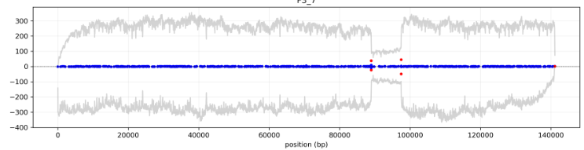

# the experiment

the data analysed in this repository come from a run of aionostat.

3 vials were set up, in the first one no phages were inserted, in the second one and in the third 3 phage strains were inserted.
the phage strains used are: EC2D2, EM11, EM60.

some samples were collected to monitorate the phages over time. for now we will focus on phage samples.

# Phage isolates

when the experiment finished, 4 phages were isolated from each vial, and sequenced. the sequencing data from the phage isolates where treatedwith the rec-genome-analysis pipeline.

the pipeline carries out these steps:

1. assembly of the isolates genome (presumebly recombined)
2. mapping of the sequencing reads on the assembled genome
3. alignment of reference sequences (non recombined genomes) on the assembly
4. alignment of the reference sequences between each other to estalish common parts
5. alignment of the assembly sequences between each other to get the differences

the alignment data is handled by a python script to display the important properties of the alignments.

the most interesting thing for us is the mutation density between the assebmlies and the references. we want to display a measure of the evolutionary distance between our assembly and the references. if the assembly will show closeness to only one reference and distance from the other it means that the assembly is not a recombinant genome, it is just one of the references.
if half of the assembly genomes show a notable distance to the first reference and not to the second and the other half is distant to the second assembly and not to the first, the genome could be a recombinant.

the results that we obtained are striking!

## population 2

clone-1:

clone-2:

clone-3:

clone-4:

the first thing that we notice is that c1,3 are similar between each other and different from c2,4. possibly, the formers represent recombined genomes correctly assembled while the latters have some contaminant DNA that coused some strange behaviour.

from what we can see the phages in population 2 have recombined. a small portion of EM60 was integrated in EM11 genome.

### clone 1

shows perfect characteristics of recombination

### clone 2

clone 2 presents some strange characteristics:

1. the first part is not mapped by any phage genome.
    by blasting this sequence we find that it is part of E. coli genome. by looking at the reads mapped on the assembly we have something like this:

    

    this region has been caused by some contaminant DNA, linked to a read that contains also the phage genome.

2. there are some supplementary alignments at the borders of the genome, no clue of what they could be.

    

### clone 3

this genome, more or less at base 110 000, shows a high distance from EM11.

### clone 4

as clone 2, the first part doesn't map to any reference. it is caused by contaminant DNA.

in this case the borders of the genome are fine

## population 3

clone-1:

clone-2:

clone-3:

clone-4:

population 3 doesn't seem to show any recombination or strange behaviours.

# Phage populations

each day a sample was taken from the phage vials, these samples might contain different genomes at the same time, we are working with populations of phages.

the data was analysed with the evo-genome-analysis pipeline. the pipeline was run with the following config file:

<pre>
input: "data/"
output: "results/"
pileups:
    P2_references:
    - "P2_1"
    - "P2_3"
    - "P2_5"
    - "P2_7"
    P3_references:
    - "P3_1"
    - "P3_3"
    - "P3_5"
    - "P3_7"
</pre>

the reference files contain 3 phage genome references. the results will be obtained for each reference.

## population 2

### coverage

the coverage information will help us understand which phages are in the vials at each timepoint. more precisely, which part of the genome of each phage is present in the vial at each timepoint.

summary of the coverage info across timepoints:

1. <pre>
    ----- primary mappings -----
            n. reads  avg. read len (bp)  tot mapped len (bp)  avg. coverage
    EC2D2           14         3398.785714                47160       0.312850
    EM11         36696         2653.373801             95130613     674.154481
    EM60         44339         2832.710413            122882592     897.555965
    unmapped       192         3377.286458                    0            NaN
    </pre>

3. <pre>
    ----- primary mappings -----
            n. reads  avg. read len (bp)  tot mapped len (bp)  avg. coverage
    EC2D2            5         1510.600000                 7439       0.049349
    EM11        195367         4188.833646            802039965    5683.752259
    EM60         37464         3675.723041            134798564     984.592310
    unmapped       451         2679.201774                    0            NaN
    </pre>

5. <pre>
    ----- primary mappings -----
            n. reads  avg. read len (bp)  tot mapped len (bp)  avg. coverage
    EC2D2            1          364.000000                  358       0.002375
    EM11        131485         4815.797817            620594881    4397.919942
    EM60         32607         4395.796823            140529318    1026.450741
    unmapped       905          743.872928                    0            NaN
    </pre>

7. <pre>
    ----- primary mappings -----
            n. reads  avg. read len (bp)  tot mapped len (bp)  avg. coverage
    EC2D2          NaN                 NaN                  NaN            NaN
    EM11      188363.0         4416.521589          813721200.0    5766.532730
    EM60       53861.0         4012.414084          211914937.0    1547.863799
    unmapped     425.0         2805.494118                  0.0            NaN
    </pre>

#### EC2D2

super low coverage, at the end of day one, it was already almost all gone.

#### EM11

the amount of the initial part of the genome of EM11 is slowly decreasing over time.

a huge gap that happens after day 1 is visible in the middle of the genome.

#### EM60

the amount of initial part of EM60 genome is increasing fast over time.

the last part is decreasing a bit more slowly than the rest.

### clips

#### EM11

looking at the number of clips, we have a lot of them in the area affected by the deletion.

#### EM60

no significant clips

### gaps

#### EM11

there is a huge concentration of gaps in the area affected by the deletion

just one other gap has an interesting behaviour in time

we will study later the small sites that underwent changes

#### EM60

EM60 has a region with a high number of gaps, corresponding to 120 000, it is in correspondance of the last part of the genome, were the coverage is higher with respect to the non recombined part but lower than the recombined.

it could be a second recombination event that is less common than the first one.

most of the trajectories go to zero probably in the regions that loose coverage over time. we can see good scores in the regions that stay in the population.

### insertions

#### EM11

some insertions are present and are spreading in the population but nothing traceable to genome rearrangements

we will study later these insertions.

#### EM60

there are a lot of insertions in the junction between the two genomes, probably they are marked as significant just because the coverage is going down, they could be just noise.

there is an insertion at the beginning but looking at its trajectory we can determine that it is not significant.

there is also some signal in correspondance of the region near 120 000.

### consensus

#### EM11

from the summary we can see that there is a region which is highly affected by mutations, it is the junction of the recombination event.

it is strange the fact that all the mutations show up in the last timepoint. but probably this is due to the fact that in this region there are chimeric reads of the two genomes and the part of EM60 of the read is not clipped (see clips in EM11 genome) but they are paired with a lot of mismatches.

there are a lot of significant consensus trajectories, they will have to be selected by hand.

#### EM60

as expected also in this genome there are a lot of mismatches in the junction. the previously formulated hypothesis could be confirmed.

there is also another region that has a lot of mutations, that's again the region at the end of the genome that is acquiring coverage.

in this case there is no correspondance on EM11, not suggesting recombination. maybe it is recombining with somehting else or some parts of EM11 are just mapped onto this region, causing all the phenomena that we are seeing here.

From the alignment between EM11 and EM60 we could not say that this region is more similar.

once again there are a lot of significant non consensus trajectories, we will look them in the future.

### supplementary alignments

this is the data of the last timestep, it is the timestep in which the signal is more clear. the two graphs in the top left and bottom right are the supplementary alignments inside the same genome.

in EM11 we see supplementary alignments on the diagonal with the exception for the region with the gap that shows an off diagonal supplementary mapping, given by the reads that span the gap.

in EM60 we see the diagonal signal only in the region that did recombination. (a bit also in the region at the end with slightly higher coverage)

we can see that there are some common supplementary alignments between the two genomes but i think they are just noise. they are focused on the first part of the graph just because is the only part of EM60 that has survived.
if we look at the first timestep we will find some supplementary alignments allover the two genomes.

### secondary alignments

there is some off diagonal signal more or less in correspondence of the gap, i could not guess why.

in this case the majority is on the top right and bottom left because each read could in principle map also in the other genome

## recap

the signs of recombination were found in:

- coverage: some areas of genomes become more or less covered (presence of gaps and insertions only in these areas.)
- non consensus region in correspondance of the recombination site

we can be pretty sure that these are signs of recombinations thanks to the reconstructed recombinant genomes.

## population 3

### coverage

summary of the coverage info across timepoints:

1. <pre>
    ----- primary mappings -----
            n. reads  avg. read len (bp)  tot mapped len (bp)  avg. coverage
    EC2D2           10         4993.400000                49588       0.329653
    EM11        169958         5572.249579            907297418    6450.333203
    EM60          2481         2330.233777              5426791      39.801615
    unmapped       176         3765.500000                    0            NaN
    </pre>

3. <pre>
    ----- primary mappings -----
            n. reads  avg. read len (bp)  tot mapped len (bp)  avg. coverage
    EC2D2          NaN                 NaN                  NaN            NaN
    EM11      120721.0         3116.488788          363456028.0    2583.951457
    EM60        3136.0         1604.736926            4671650.0      34.263198
    unmapped     215.0         4657.125581                  0.0            NaN
    </pre>

5. <pre>
    ----- primary mappings -----
            n. reads  avg. read len (bp)  tot mapped len (bp)  avg. coverage
    EC2D2            5         1843.000000                 9081       0.060369
    EM11        107407         1901.487873            196881417    1399.707214
    EM60          4103         1144.653668              4298746      31.528215
    unmapped       576         2256.750000                    0            NaN
    </pre>

7. <pre>
    ----- primary mappings -----
            n. reads  avg. read len (bp)  tot mapped len (bp)  avg. coverage
    EC2D2          NaN                 NaN                  NaN            NaN
    EM11       38445.0         2251.192769           83552582.0     594.008076
    EM60        1565.0         1347.313099            2051883.0      15.049088
    unmapped      93.0         3362.763441                  0.0            NaN
    </pre>

in this case the proportions of EM11 and EM60 are less similar. this makes the whole detection of recombination already more difficult.

#### EM11

what we can see from this coverage is that there seems to be a gap, and there is a strange dip in coverage near the end of the genome

#### EM60

this is a way noisier plot, we see some spikes at the beginning, no idea why are they there. they are abundant from day 1.

the general trend of coverage goes toward zero during the experiment, except for the last part, this has a profile similar to the recombination of population 2.

### clips

#### EM11

last timepoint:

there are clips in correspondence of the gap and at the borders of the genome, in theory the reference is in the correct reading frame as the linearised genome, so we shouldn't have such clips.

#### EM60

we cannot determine if there are actually some clipped regions from this data, they are always in correspondence of low covered regions.

### gaps

#### EM11

there are some gaps at the beginning, probably just some mutation on a gene. some other gap near 8000 again it is separated from what we have seen until now.

#### EM60

there is one gap! in the region that is increasing in coverage. also in the previous population we saw that the region that recombined was of course the only one that could get modifications.

### insertions

### EM11

no significant insertions

### EM60

we have some insertions at the borders of the region with higher coverage, maybe it's just noise that comes up with low coverage.

it is interesting to notice that we had the same situation for the recombination in population 2.

last timestep:

### consensus

#### EM11

there are very few mutations and no significant trajectories, this is so strange.

#### EM60

in EM60 we have some mismatches at the beginning of the "recombination region" our hypothesis is getting more probable. this is very consistent with the previous population. the reads at the border of the recombination regions are mapped on one or the other genome and they have mutations.

there is one significant trajectory outside the recombination region

### supplementary alignments

on the self-supplementaries of EM11 we can clearly see the gap.

we do not have much signal for EM60 but the few supplementaries are in the region that is more covered.

maybe we are not getting the correct supplementary coordinates because the code is wrong. or because it is hard in general.

in this case there is way less noise also at timepoint 1 with respect to population 2, probably because we have less EM60.

in EM11 we see supplementary alignments at the borders of the genome, we did not see them in population 2, why is that?

### secondary alignments
