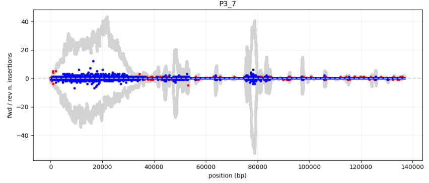
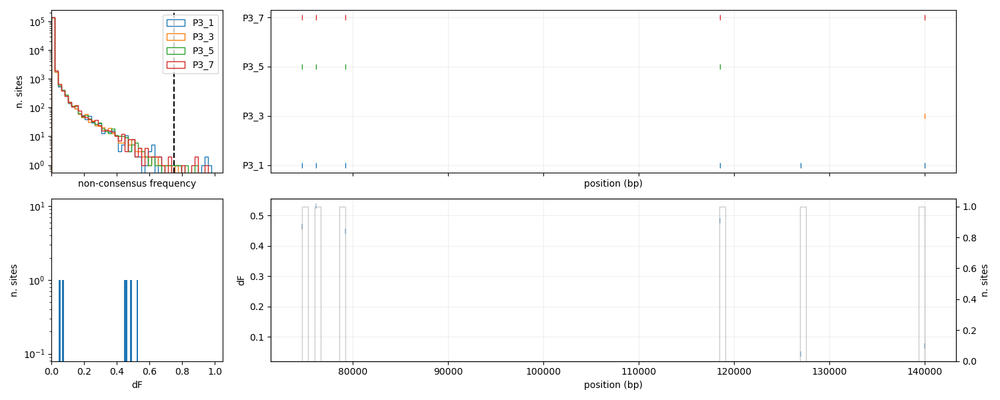
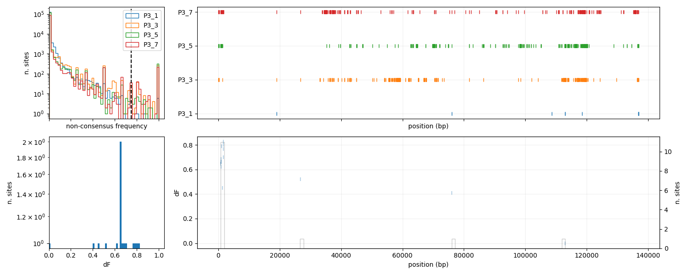
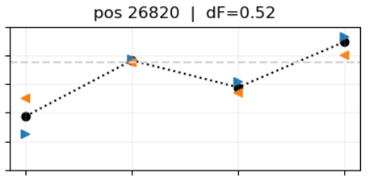
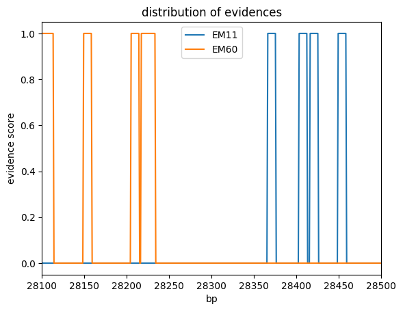

# the experiment

the data analysed in this repository come from a run of aionostat.

3 vials were set up, in the first one no phages were inserted, in the second one and in the third 3 phage strains were inserted.
the phage strains used are: EC2D2, EM11, EM60.

some samples were collected to monitorate the phages over time. for now we will focus on phage samples.

# Phage isolates

when the experiment finished, 4 phages were isolated from each vial, and sequenced. the sequencing data from the phage isolates where treatedwith the rec-genome-analysis pipeline.

the pipeline carries out these steps:

1. assembly of the isolates genome (presumebly recombined)
2. mapping of the sequencing reads on the assembled genome
3. alignment of reference sequences (non recombined genomes) on the assembly
4. alignment of the reference sequences between each other to estalish common parts
5. alignment of the assembly sequences between each other to get the differences

the alignment data is handled by a python script to display the important properties of the alignments.

the most interesting thing for us is the mutation density between the assebmlies and the references. we want to display a measure of the evolutionary distance between our assembly and the references. if the assembly will show closeness to only one reference and distance from the other it means that the assembly is not a recombinant genome, it is just one of the references.
if half of the assembly genomes show a notable distance to the first reference and not to the second and the other half is distant to the second assembly and not to the first, the genome could be a recombinant.

the results that we obtained are striking!

## population 2

clone-1: this clone shows the perfect characteristics of recombination

clone-2:

clone-3: this is a good recombinant but at base 110 000, shows a high distance from EM11.

clone-4:

the first thing that we notice is that c1,3 are similar between each other and different from c2,4. possibly, the formers represent recombined genomes correctly assembled while the latters have some contaminant DNA that coused some strange behaviour.

from what we can see the phages in population 2 have recombined. a small portion of EM60 was integrated in EM11 genome.

### clone 2

clone 2 presents some strange characteristics:

1. the first part is not mapped by any phage genome.
    by blasting this sequence we find that it is part of E. coli genome. by looking at the reads mapped on the assembly we have something like this:

    

    this region has been caused by some contaminant DNA, linked to a read that contains also the phage genome.

2. there are some supplementary alignments at the borders of the genome, no clue of what they could be.

    

### clone 4

as clone 2, the first part doesn't map to any reference. it is caused by contaminant DNA.

in this case the borders of the genome are fine

## population 3

clone-1:

clone-2:

clone-3:

clone-4:

population 3 doesn't seem to show any recombination or strange behaviours.

# Phage populations

each day a sample was taken from the phage vials, these samples might contain different genomes at the same time, we are working with populations of phages.

the data was analysed with the evo-genome-analysis pipeline. the pipeline was run with the following config file:

<pre>
input: "data/"
output: "results/"
pileups:
    P2_references:
    - "P2_1"
    - "P2_3"
    - "P2_5"
    - "P2_7"
    P3_references:
    - "P3_1"
    - "P3_3"
    - "P3_5"
    - "P3_7"
</pre>

the reference files contain 3 phage genome references. the results will be obtained for each reference. note that we used as reference the phage assembly produced by our lab for the phage evolution experiment. we decided to use such references because they are more coherent with the linearised form of the phage genome and they allow a clearer interpretation of the data.

it is very important during this analysis to find out what are the signs of recombination. since we know that some ricombination happened in population two, we can try to see what the recombination has caused in the population alignment data. we want to learn how we can detect recombination from population data. establish some principles.

then we can look at the second population to see if there are some similar signals that suggest the start of recombination or something similar.

during the analysis i will also look for signals of phage evolution. i will try to keep the two categories of results separated.

## population 2

### coverage

the coverage information will help us understand which phages are in the vials at each timepoint. more precisely, which part of the genome of each phage is present in the vial at each timepoint.

summary of the coverage info across timepoints:

1. <pre>
    ----- primary mappings -----
            n. reads  avg. read len (bp)  tot mapped len (bp)  avg. coverage
    EC2D2           14         3398.785714                47160       0.312850
    EM11         36696         2653.373801             95130613     674.154481
    EM60         44339         2832.710413            122882592     897.555965
    unmapped       192         3377.286458                    0            NaN
    </pre>

3. <pre>
    ----- primary mappings -----
            n. reads  avg. read len (bp)  tot mapped len (bp)  avg. coverage
    EC2D2            5         1510.600000                 7439       0.049349
    EM11        195367         4188.833646            802039965    5683.752259
    EM60         37464         3675.723041            134798564     984.592310
    unmapped       451         2679.201774                    0            NaN
    </pre>

5. <pre>
    ----- primary mappings -----
            n. reads  avg. read len (bp)  tot mapped len (bp)  avg. coverage
    EC2D2            1          364.000000                  358       0.002375
    EM11        131485         4815.797817            620594881    4397.919942
    EM60         32607         4395.796823            140529318    1026.450741
    unmapped       905          743.872928                    0            NaN
    </pre>

7. <pre>
    ----- primary mappings -----
            n. reads  avg. read len (bp)  tot mapped len (bp)  avg. coverage
    EC2D2          NaN                 NaN                  NaN            NaN
    EM11      188363.0         4416.521589          813721200.0    5766.532730
    EM60       53861.0         4012.414084          211914937.0    1547.863799
    unmapped     425.0         2805.494118                  0.0            NaN
    </pre>

#### EC2D2

super low coverage, at the end of day one, it was already almost all gone.

#### EM11

the amount of the initial part of the genome of EM11 is slowly decreasing over time.

a huge gap that happens after day 1 is visible in the middle of the genome.

#### EM60

the amount of initial part of EM60 genome is increasing fast over time.

the last part is decreasing a bit more slowly than the rest.

### clips

#### EM11

looking at the number of clips, we have a lot of them in the area affected by the deletion.

#### EM60

no significant clips

### gaps

#### EM11

there is a huge concentration of gaps in the area affected by the deletion

just one other gap has an interesting behaviour in time

we will study later the small sites that underwent changes

#### EM60

EM60 has a region with a high number of gaps, corresponding to 120 000, it is in correspondance of the last part of the genome, were the coverage is higher with respect to the non recombined part but lower than the recombined.

it could be a second recombination event that is less common than the first one.

most of the trajectories go to zero probably in the regions that loose coverage over time. we can see good scores in the regions that stay in the population.

### insertions

#### EM11

some insertions are present and are spreading in the population but nothing traceable to genome rearrangements

we will study later these insertions.

#### EM60

there are a lot of insertions in the junction between the two genomes, probably they are marked as significant just because the coverage is going down, they could be just noise.

there is an insertion at the beginning but looking at its trajectory we can determine that it is not significant.

there is also some signal in correspondance of the region near 120 000.

### consensus

#### EM11

from the summary we can see that there is a region which is highly affected by mutations, it is the junction of the recombination event.

it is strange the fact that all the mutations show up in the last timepoint. but probably this is due to the fact that in this region there are chimeric reads of the two genomes and the part of EM60 of the read is not clipped (see clips in EM11 genome) but they are paired with a lot of mismatches.

there are a lot of significant consensus trajectories, they will have to be selected by hand.

#### EM60

as expected also in this genome there are a lot of mismatches in the junction. the previously formulated hypothesis could be confirmed.

there is also another region that has a lot of mutations, that's again the region at the end of the genome that is acquiring coverage.

in this case there is no correspondance on EM11, not suggesting recombination. maybe it is recombining with somehting else or some parts of EM11 are just mapped onto this region, causing all the phenomena that we are seeing here.

From the alignment between EM11 and EM60 we could not say that this region is more similar.

once again there are a lot of significant non consensus trajectories, we will look them in the future.

### supplementary alignments

this is the data of the last timestep, it is the timestep in which the signal is more clear. the two graphs in the top left and bottom right are the supplementary alignments inside the same genome.

in EM11 we see supplementary alignments on the diagonal with the exception for the region with the gap that shows an off diagonal supplementary mapping, given by the reads that span the gap.

in EM60 we see the diagonal signal only in the region that did recombination. (a bit also in the region at the end with slightly higher coverage)

we can see that there are some common supplementary alignments between the two genomes but i think they are just noise. they are focused on the first part of the graph just because is the only part of EM60 that has survived.
if we look at the first timestep we will find some supplementary alignments allover the two genomes.

### secondary alignments

there is some off diagonal signal more or less in correspondence of the gap, i could not guess why.

in this case the majority is on the top right and bottom left because each read could in principle map also in the other genome

## recap

thanks to the reconstructed recombinant genomes we were able to determine that the signs of recombination in population data can be found in:

- coverage: some areas of genomes become more or less covered (presence of gaps and insertions only in these areas.)
- non consensus region in correspondance of the recombination site

apart from the ovious recombination, the genome probably have mixed also around base 120 000. we have strong evidence in coverage and non consensus data so we are happy.

## population 3

### coverage

summary of the coverage info across timepoints:

1. <pre>
    ----- primary mappings -----
            n. reads  avg. read len (bp)  tot mapped len (bp)  avg. coverage
    EC2D2           10         4993.400000                49588       0.328957
    EM11        169971         5571.966836            930354051    6593.065395
    EM60          2480         2345.018145              5585607      40.798251
    unmapped       164         3683.000000                    0            NaN
    </pre>

3. <pre>
    ----- primary mappings -----
            n. reads  avg. read len (bp)  tot mapped len (bp)  avg. coverage
    EC2D2          NaN                 NaN                  NaN            NaN
    EM11      120759.0         3114.871844          368685238.0    2612.732090
    EM60        3109.0         1664.498231            4763118.0      34.790648
    unmapped     204.0         4586.500000                  0.0            NaN
    </pre>

5. <pre>
    ----- primary mappings -----
            n. reads  avg. read len (bp)  tot mapped len (bp)  avg. coverage
    EC2D2            5         1843.000000                 9081       0.060242
    EM11        107361         1902.141420            199082433    1410.821502
    EM60          4165         1147.916206              4328376      31.615216
    unmapped       560         2201.132143                    0            NaN
    </pre>

7. <pre>
    ----- primary mappings -----
            n. reads  avg. read len (bp)  tot mapped len (bp)  avg. coverage
    EC2D2          NaN                 NaN                  NaN            NaN
    EM11       38406.0         2253.608629           84499218.0     598.813827
    EM60        1607.0         1315.255134            2057363.0      15.027340
    unmapped      90.0         3363.111111                  0.0            NaN
    </pre>

in this case the proportions of EM11 and EM60 are less similar. this makes the whole detection of recombination already more difficult.

#### EM11

what we can see from this coverage is that there seems to be a gap in the same region as population 2. the rest of the genome has stable coverage over the days.

#### EM60

this is a way noisier plot, we see some huge spikes in the second part of the genome, no idea why are they there. another strange characteristic of them is that they are abundant from day 1.

the general trend of coverage goes toward zero during the experiment, except for the initial, this has a profile similar to the recombination of population 2 and it is in the same region.

### clips

#### EM11

last timepoint:

there are just clips in correspondence of the gap.

#### EM60

all the clip signals are probably noise, they are in regions with low coverage.

### gaps

#### EM11

we just see the deletion as in population 2.

#### EM60

there is one gap! in the region that is increasing in coverage. also in the previous population we saw that the region that recombined was of course the only one that could get modifications.

it is very probable that also in this case the initial part of the genome is recombining, but there are too many EM11 to see the effect.

### insertions

### EM11

no significant insertions

### EM60

we have some insertions at the borders of the region with higher coverage, maybe it's just noise that comes up with low coverage.

it is interesting to notice that we had the same situation for the recombination in population 2.

last timestep:

a couple of them at the beginning seem to have an ok trajectory:

### consensus

#### EM11

there are very few mutations and no significant trajectories, this is so strange.

maybe they are a bit concentrated in the first part.

#### EM60

in EM60 we have some mismatches at the beginning of the "recombination region" our hypothesis is getting more probable. this is very consistent with what we observed in the previous population. the reads at the border of the recombination regions are mapped on one or the other genome and they have mutations.

actually in the previous population the mutations were in the junction internal to the genome, not at the border, which makes a lot more sense.

there is one significant trajectory outside the recombination region

### supplementary alignments

on the self-supplementaries of EM11 we can clearly see the gap.

we do not have much signal for EM60 but the few supplementaries are in the region that is more covered. i.e. the one that is surviving thanks to recombinant phages.

why are we not seeing any supplementary alignments between the two genomes? they are too similar, the aligner just maps the whole read onto one of the references.

in this case there is way less signal in EM60 also at timepoint 1, probably because we have less EM60.

### secondary alignments

again the majority of secondary mapping are between the two genomes, and again there is some off diagonal signal on the gap.

there is no signal suggesting something about genome recombination.

## recap

- the coverage data suggests that there could be some amount of recombinant phages. that's the strongest evidence that we have.
    they are less with respect to the first population maybe because of the initial missproportion between EM11 and EM60

# going more in depth

## phage clone assemblies

we can clean each assembly, keeping only the non contaminated part and putting them all in the right direction, this is the result:

## population 2

clone-1:

clone-2:

clone-3:

clone-4:

## population 3

clone-1:

clone-2:

clone-3:

clone-4:

## spikes in population data

in the coverage plots of EM60 there were some strange spikes, especially in population 3. we want to investigate them to see if they are misalignments and distinguish them from the recombination signal

### what are they?

the first suspect that we had when we saw those spikes was that they are highly homologous regions between the two genomes, and in these regions the aligner does not know where to map the reads.

to check for this we can construct a dotplot to search for hyper similarities. I implemented a dotplot in evo-genome-analysis pipeline, for now the script takes manually the inputs (i only gave the inputs to make the EM60 dotplots, since they are the most interesting ones). it is inside the pipeline just to launch it. it should be integrated better with the rest of the pipeline.

the dotplot shows that the regions of EM60 genome in population 2 that have spikes are in correspondance of hyper homologous regions.

EM60 P3:

EM60 P2:

### how to get rid of them?

now we want to try to get rid of these spikes, they are caused by misalignments and they interfere with our observations on the dataset. at the same time we would like our dataset to be more suitable to study recombination, that is to say that we would like that the recombinant reads are not aligned for their whole length on one genome. they should be aligned only in the region with low mutation density, while the other region is clipped and it has a supplementary mapping in correspondence of the other genome.

to achieve this we can try to modify the minimap2 parameters and filter out short reads to avoid mapping them on hyper homologous regions.

1. the minimap parameters have to be modified to allow to have more clips. right now the tool aligns reads for their entire length, inserting a lot of mismatches for the recombinant reads. we want to reach a situation in which the parts of the reads that have a lot of mismatches are not aligned but clipped.
we tried to use -asm5 option and the number of clips was modified:

    EM11 P2:

    

    there are very few clips in correspondence of the recombination point (near 3000), but still they are more than in the original plot. (also there are a lot of clipsnear 4000, maybe there has been some evolution event (not related to recombination))

    the use of asm5 made the border of the recombinant region more sharp:

    

    overall there are not significant improvements. moreover, using asm5 increases the number of supplementary and secondary alignment a lot for some reason.

     
    

2. the length filter was done with seqkit, the objective was to avoid the mapping of short reads that are identical between the two genomes (in correspondance of the spikes). I placed the threshold at 1000 (consider that half of the reads have length less than 2500), but this did not have any beneficial effect on the spikes

    

this approach is not really working, we created an [issue on minimap github page](https://github.com/lh3/minimap2/issues/1112) to see if someone knows how to tweak the parameters better than us.

## a more precise quantification of recombination

since we did not manage to get a dataset that is more suitable to study recombination, we will proceed with what we have. we will use what minimap is giving us: the recombinant regions have a different coverage and a high mutation density.

the idea is to use the mutations pattern to recognise when a read is made of two different genomes, we want a precise method.

we will just start by defining the possible evidences, for the sequence of a read, to belong to a genome or another. imagine to have a msa between a chimeric read and the two genomes. if we go though each nucleotide (considering 3 nucleotides), there are 4 possible situations (we will just consider the position where all 3 sequences align):

1. the nucleotide of the read is different from both refernece nucleotides, in this case we have no information

2. the two reference nucleotides are equal, and the read nucleotide is equal to them, in this case we have no information about the apparteinence of the read to one of the two references.

3. the read nucleotide is equal to the first reference nucleotide but different from the second: this is a clear evidence that this portion of the read belongs to the first reference

4. the read nucleotide is equal to the second reference nucleotide but different from the first: this is a clear evidence that this portion of the read belongs to the second reference.

we want to record all these evidences and represent them in a plot.

### finding evidences in clone assemblies

we start working with the recombinant clones that we assembled, it will be our positive control. we use mafft to make the msa between the assembly and the two references.

we will just analyse the clones of population 2 since they are the only recombinant ones. by plotting the distribution of the evidences we get something like this:

C1:

C2:

C3:

C4:

on these graphs we can inspect the recombination border with a smaller convolution window.

we have a range of 50 bp in which the recombination has happened.

we can also inspect the region in clone 3 that shows a peak in EM60 evidences.

### measuring recombination in the population of reads

now we want to try with reads, we can take reads from the last populations, selecting for the best matching ones. we use mafft and then we analyse the msa.

we go throught the bam file and get the names of the reads that have the longest mapping length (average between primary and secondary mapping).

results in the folder.

this may be ok but mafft requires a lot of time to run, we have to find another way.

# what next?

- make the analysis of reads quicker (align each fragment to the msa of the two references, keep length) (https://mafft.cbrc.jp/alignment/server/add_fragments.html) (clustalw,)
- implement a way to represent the fraction of recombination event in a certain point with respect to the non recombinant reads
- run on the whole dataset

- map population data on the recombinant assembly
- look deeper at evolution of phages in the dataset.
- normalise for expected values in evidence distribution

## another approach can be tried: splitting the reads before and then mapping them to the pool of reference genome, if part of a read is mapped on a genome and another part on another genome, we suppose that the read is recombinant.