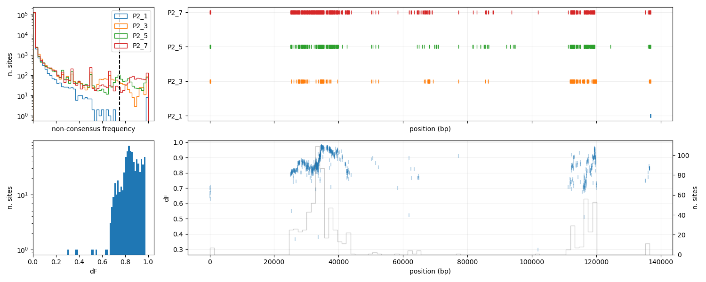
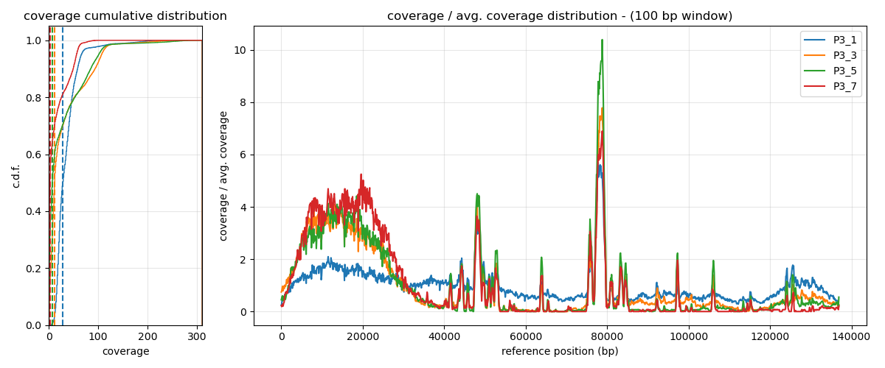
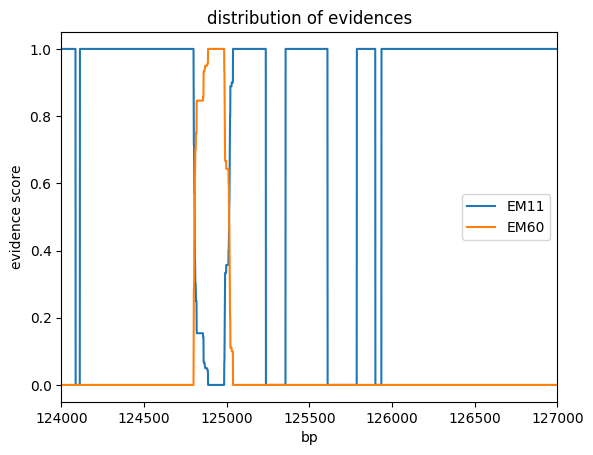

# Report

This note contains the recap of the results found in the dataset produced by an Aionostat experiment carried out with multiple phages in each vial. each vial contained 3 phages: EC2D2, EM11, EM60.

We expect the difference phages to recombinate during the experiment and we are searching for evidences of recombination in the dataset.

Two different types of phage genome data where analysed:

- phage isolates: some phages were isolated at the end of the experiment, amplified and sequenced.
- phage populations: at multiple timesteps the content of the vials was sequenced.

## phage isolates

### clone-1 population 2:

### clone-2 population 2:

### clone-3 population 2:

### clone-4 population 2:

### clone-1 population 3:

all the isolates from population 3 are similar to the first one, they show no evidence of recombination.

## phage populations

The data from phage populations was aligned thorugh minimap with the following command:

<pre>
minimap2 -a -x map-ont {input.ref} {input.fastq} > {output.sam}
        samtools sort {output.sam} > {output.bam}
        samtools index {output.bam}
</pre>

We tried to use the option -x asm5 but the only advantage that we got was that the coverage showed more sharp edges in correspondance of the border of the regions that were recombinated. This option messed up the non consensus frequency signal of recombination so I decided to consider the result obtained with the default mapping of minimap2. THE PLOTS OF THIS REPORT COME ALL FROM THE MAPPING PERFORMED WITHOUT ASM5.

With default minimap2 mapping we found clear signals of recombinations in COVERAGE and NON CONSENSUS FREQUENCY distribution.

Population 2 showed more recombination evidences with respect to population 3. This is due to the fact that in population 3 the relative initial quantities of phages were very uneven. This reduces the probability and the signal of recombination and it creates big artifacts when mapping the reads on two references.

### coverage population 2

EM11:

EM60:

In the first part of the genome we can see that the coverage of EM11 is decreasing over time, while the coverage of EM60 is increasing (while the rest of the genome is disappearing).

We can see that in EM60 there are some light bumps along the genome and at the end, around 120 kb there is a region that remains a bit covered in time.

### non consensus frequency population 2

EM11:

EM60:

Fro the non consensus frequency summary plots we can see that the border of the region of recombination is full of snps, this is because minimap is mapping recombinant reads on a genome or the other.

### coverage populetion 3

EM11:

EM60:

The coverage of EM11 is pretty linear throughout the days, there is no sign of recombination.

In EM60 we can see that the first part of the genome is increasing in abundance as time passes and that there are some huge spikes in the rest of the genome.

The spikes are in correspondence of hyper homologous regions, we studied them through a dot plot:

### non consensus frequency population 3

the non consensus frequency data did not give any clear clue of recombination, maybe the discrepancy in coverage makes it difficult to have a signal.

## quantification of recombination

The idea is to use the mutations pattern to recognise when a read is made of two different genomes, we want a precise method. 

We will just start by defining the possible evidences, for the sequence of a read, to belong to a genome or another. imagine to have a msa between a chimeric read and the two genomes. if we go though each nucleotide (considering 3 nucleotides), there are 4 possible situations (we will just consider the position where all 3 sequences align):

1. the nucleotide of the read is different from both refernece nucleotides, in this case we have no information
2. the two reference nucleotides are equal, and the read nucleotide is equal to them, in this case we have no information about the apparteinence of the read to one of the two references.
3. the read nucleotide is equal to the first reference nucleotide but different from the second: this is a clear evidence that this portion of the read belongs to the first reference
4. the read nucleotide is equal to the second reference nucleotide but different from the first: this is a clear evidence that this portion of the read belongs to the second reference.

we want to record all these evidences and represent them in a plot.

### finding evidences in clone assemblies

we start working with the recombinant clones that we assembled, it will be our positive control. we use mafft to make the msa between the assembly and the two references.

we will just analyse the clones of population 2 since they are the only recombinant ones. by plotting the distribution of the evidences we get something like this:

C1:

C2:

C3:

C4:

I have also produced the normalised version of these plots, for the number of sites in which we can find an evidence. It looks something like this:

### Border of recombination

on these graphs we can inspect the recombination border with a smaller convolution window.

in this case, with a convolution window of 10 bp, we have a range of 100 bp in which the recombination event might have happened.

### Second recombination event

It could be also interesting to inspect the region around 120 kb that shows some peaks of evidences for EM60. In the following plots i used a convolution window of 100.

clone 1:

clone 2:

clone 3:

It is clear that also in this small region we are having some recombination.

### measuring recombination in the population of reads

We want to take reads from the populations of the last day, they should be the ones that show more recombination. We select the reads with the longer matching length.

You can find the explanation of all the steps of this analysis in the last paragraph of [note_1](note1.md).

By creating the evidence plot of single reads we managed to find some recombinant ones:

Then we tried to create a plot that summarises the evidence information of multiple reads, I analysed and summarised the information of the first 1000 best matching reads and the plot we obtain (for population 2 at last timestep) is the following:

Of course this graph is not normalised and the score depends on how many reads we have that show an evidence in each point. We can create the normalised version, but in the regions where we cannot have evidences, and in the regions where we have few reads, the plot is very noisy.

As you can see we have information only on the central part of the DNA, seems that our way of selecting reads is biased. Maybe the longest matching reads are mainly the ones that map at the centre, for this reason we have difficulties in getting information on the sides.

To correct this, we should implement a weighted sampling on the basis both on the matching length of the read and on the amount of information that we have along the genome (less information = more probability of selecting the read)
